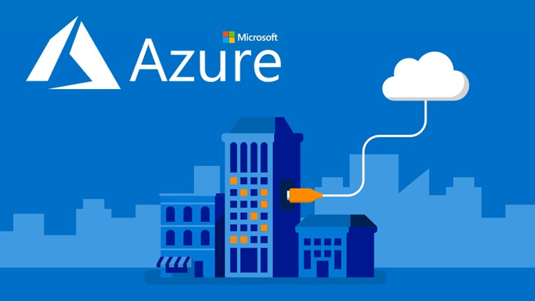
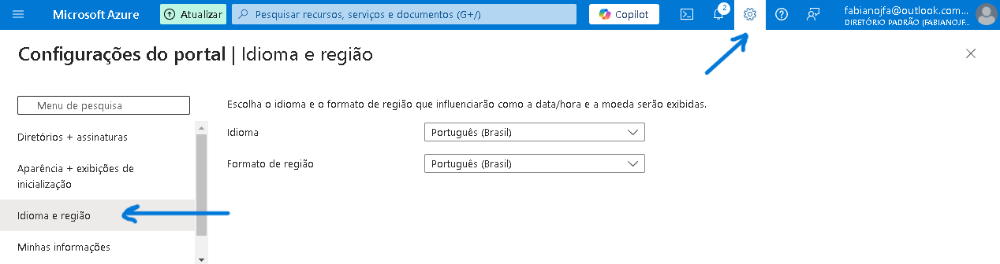
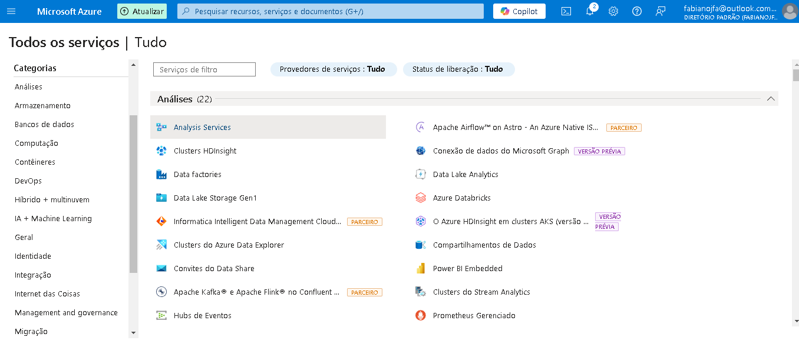
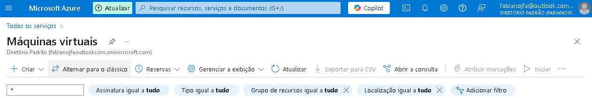
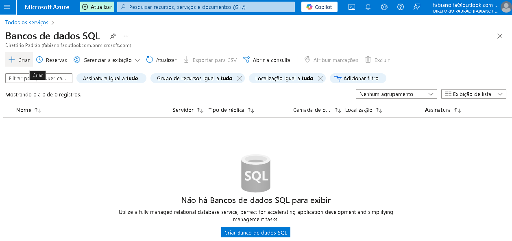

# resumo-labs-AZ-900

### Resumo dos desafios de projetos do bootcamp Microsoft Azure Essentials

* Necessario ter conta criada na plataforma Microsoft Azure
* Acesse o [Portal do Azure](https://azure.microsoft.com/pt-br/get-started/azure-portal/) para criar sua conta.
* O portal vai ser o mesmo pra todos os tipos de usuários na plataforma.

## Localizando Serviços por categoria

* Alterando idioma 

* Na imagem abaixo podemos ver todos os serviços por categoria

## Criando máquinas virtuais na azure

* No menu lateral esquerdo acesse Maquinas virtuais (irá abrir outra página) como imagem abaixo e clique em +Criar e depois em Maquina virtual do Azure
 
* Em assinatura mantenha a sua que já estará disponível
* Crie um grupo de recurso - onde sua VM passará a fazer parte deste grupo, servirá como organização do seus projetos
* Coloque um nome pra sua VM
* Escolha uma região para criar sua VM - Obs, nem todos os tamanhos de VM estão disponíveis em todas as regiões.
* Escolha a opção de disponibilidade - saiba mais sobre [zona de disponibilidade](https://learn.microsoft.com/pt-br/azure/virtual-machines/availability)
* Tipo de segurança - O tipo de segurança refere-se aos diferentes recursos de segurança disponíveis para uma máquina virtual. saiba mais sobre [Tipos de segurança](https://learn.microsoft.com/pt-br/azure/virtual-machines/trusted-launch)
* Imagem - Escolha o aplicativo ou sistema operacional base para a VM
* Arquitetura de VM - 
O Azure oferece uma opção de máquinas virtuais baseadas em x64 ou Arm64 para executar seus aplicativos.

## Configurando uma instância de Banco de Dados na Azure
* No menu lateral esquerdo acesse Bancos de dados SQL (irá abrir outra página) como imagem abaixo e clique em +Criar

* Em assinatura mantenha a sua que já estará disponível
* Crie um grupo de recurso (o mesmo da criação de VM)
* Adicione um nome ao BD SQL
* Selecione um servidor - um existente ou crie um servidor. A cadeia de conexão e as credenciais serão baseadas no servidor.
