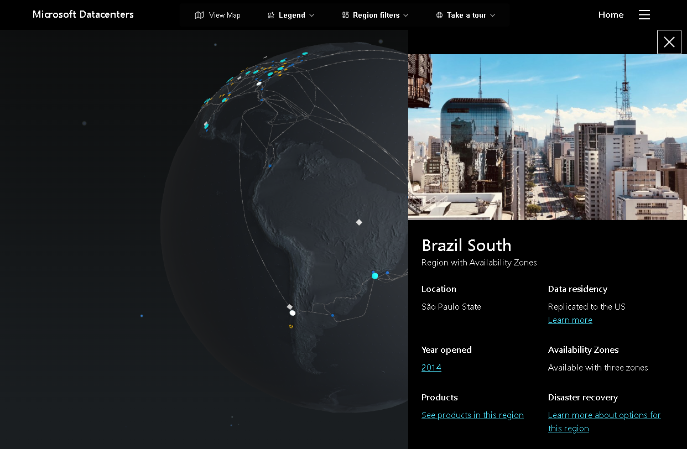
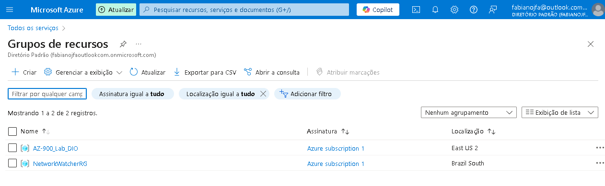
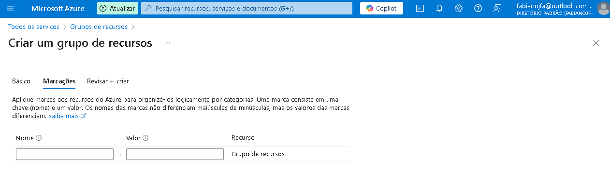
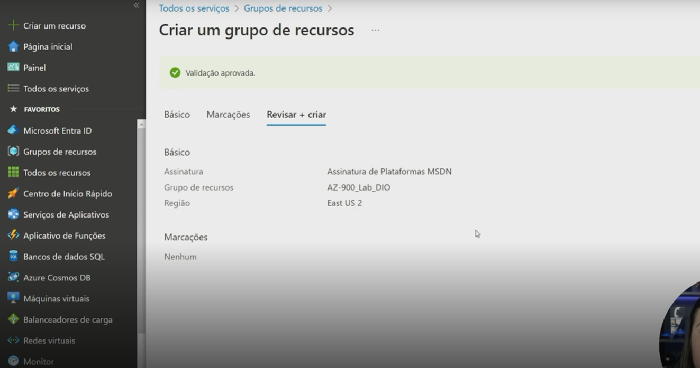
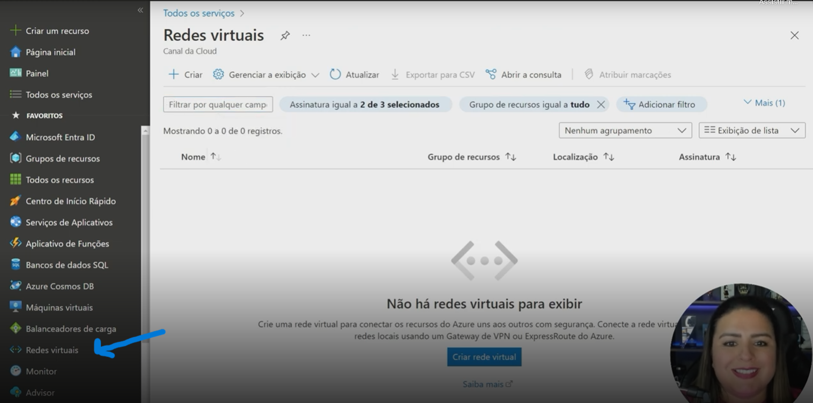
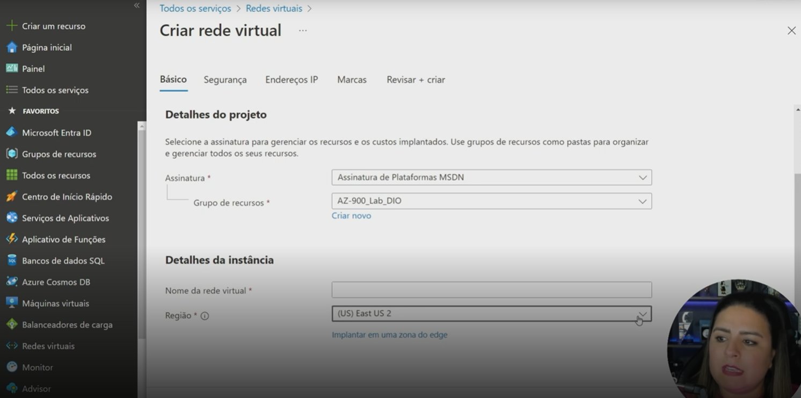
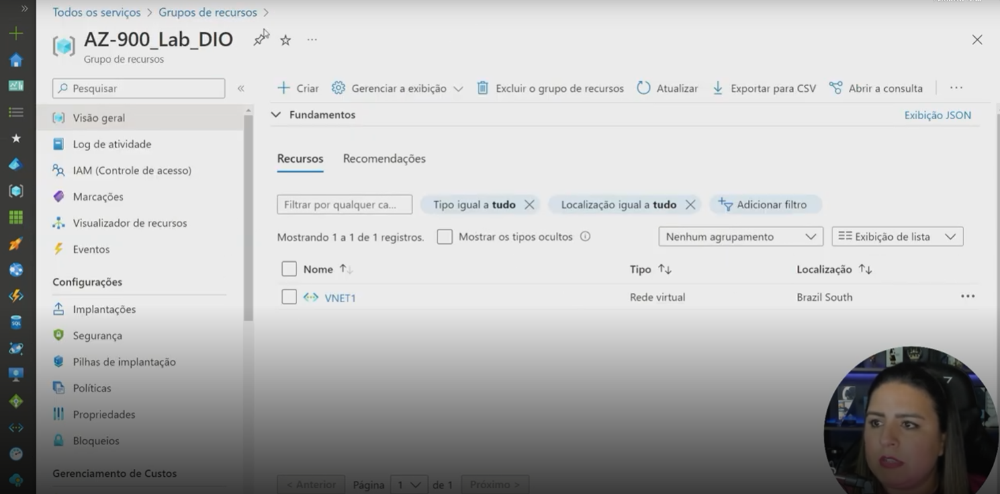
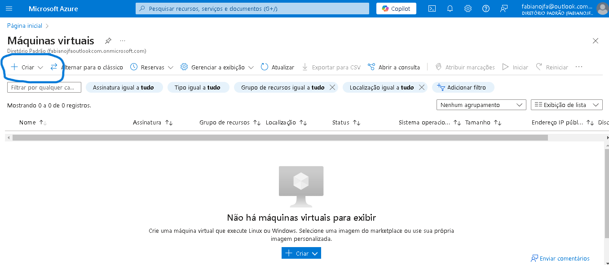
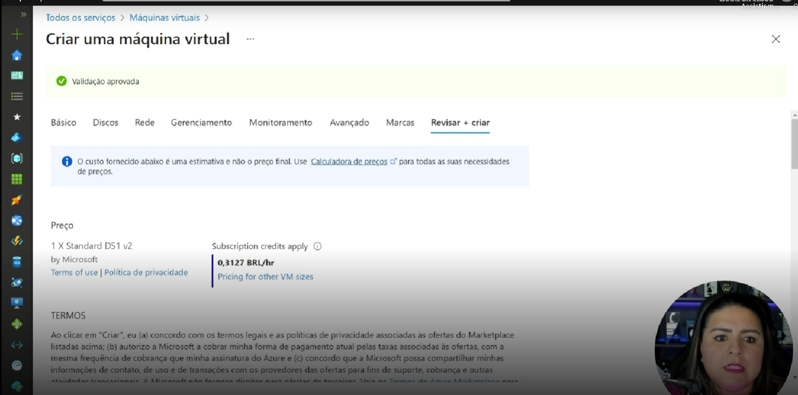

# resumo-labs-AZ-900

### Resumo dos desafios de projetos do bootcamp Microsoft Azure Essentials

* Necessario ter conta criada na plataforma Microsoft Azure
* Acesse o [Portal do Azure](https://azure.microsoft.com/pt-br/get-started/azure-portal/) para criar sua conta.
* O portal vai ser o mesmo pra todos os tipos de usuários na plataforma.

## Localizando Serviços por categoria

* Alterando idioma 

* Na imagem abaixo podemos ver todos os serviços por categoria

## Criando máquinas virtuais na azure

* No menu lateral esquerdo acesse Maquinas virtuais (irá abrir outra página) como imagem abaixo e clique em +Criar e depois em Maquina virtual do Azure
 
* Em assinatura mantenha a sua que já estará disponível
* Crie um grupo de recurso - onde sua VM passará a fazer parte deste grupo, servirá como organização do seus projetos
* Coloque um nome pra sua VM
* Escolha uma região para criar sua VM - Obs, nem todos os tamanhos de VM estão disponíveis em todas as regiões.
* Escolha a opção de disponibilidade - saiba mais sobre [zona de disponibilidade](https://learn.microsoft.com/pt-br/azure/virtual-machines/availability)
* Tipo de segurança - O tipo de segurança refere-se aos diferentes recursos de segurança disponíveis para uma máquina virtual. saiba mais sobre [Tipos de segurança](https://learn.microsoft.com/pt-br/azure/virtual-machines/trusted-launch)
* Imagem - Escolha o aplicativo ou sistema operacional base para a VM
* Arquitetura de VM - 
O Azure oferece uma opção de máquinas virtuais baseadas em x64 ou Arm64 para executar seus aplicativos.

## Configurando uma instância de Banco de Dados na Azure
* No menu lateral esquerdo acesse Bancos de dados SQL (irá abrir outra página) como imagem abaixo e clique em +Criar

* Em assinatura mantenha a sua que já estará disponível
* Crie um grupo de recurso (o mesmo da criação de VM)
* Adicione um nome ao BD SQL
* Selecione um servidor - um existente ou crie um servidor. A cadeia de conexão e as credenciais serão baseadas no servidor.
## Construindo Arquiteturas no Azure
* A Azure está em mais 60 regiões do nosso globo terrestre
* Neste [link](https://azure.microsoft.com/en-us/explore/global-infrastructure) você poderá ver varios assuntos sobre os datacenters da Azure
* Na imagem abaixo podemos ver todos os locais que estão os datacenters da Azure

* Veja o globo em 3D neste [link](https://datacenters.microsoft.com/globe/explore)

#### Criando um grupo de recurso na Azure
* No lateral esquerdo clique em Grupos de recursos e será direcionado pra proxima página como a imagem abaixo

* Clique em +Criar
* Em assinatura mantenha a sua que já estará disponível
* Crie um grupo de recurso - Um grupo de recursos é uma coleção de recursos que compartilha o mesmo ciclo de vida, permissões e políticas
* Escolha uma região - a que seja ideal para você e seus clientes
* Clique em Avançar:Marcações e sera direcionado pro próximo passo como imagem abaixo

* Nesta passo não é obrigatório, saiba mais em [Marcações](https://learn.microsoft.com/pt-br/azure/azure-resource-manager/management/tag-resources)
* Clique em Avançar para Revisar e Criar Recurso, veja na imagem abaixo este passo

* Após recurso criando você poderá navegar sobre as opções do recurso no menu lateral esquerdo como imagem abaixo.

#### Após criado o recurso vc pode trazer itens de outros locais pra colocar no recurso criado
* Vamos criar uma Rede virtual para colocar no nosso recursos, veja na imagem abaixo.

* Clique em +Criar
* Em seguida configure como exemplo na imagem abaixo, perceba que ele já seleciona o grupo de recurso já criado.

* Adicione um nome pra sua rede virtual
* Selecione uma região como por ex: South America Brazil South
* Agora Clique em Analisar e criar
* Tudo feito vá no seu recurso criado e dentro dele já vai estar seu recurso de rede virtual criado, como na imagem abaixo.

## Configurando Recursos e Dimensionamentos em Máquinas Virtuais na Azure
* Primeiro vamos criar uma VM seguindo os passos abaixo

* Em assinatura irá ficar já predefinido com sua assinatura existente
* No grupo de recurso selecionamos um grupo já criado "AZ-900_Lab_DIO"
* Nome da máquina virtual por ex: "machine01"
* Região podemos escolher a (US) East US 2
* Em opções de disponibilidade deixamos como "Nenhuma redundância de infraestrutura necessário"
* Em imagem selecionamos "Windows Server 2019 Datacenter - x64 Gen2"
* Em tamanho vamos escolher a "Standard_DS1_v2 - 1 vcpu, 3.5 GiB memória (US$ 85,41/mês)" Obs: Selecione um tamanho de VM para dar suporte à carga de trabalho que você deseja executar. O tamanho escolhido determina fatores como capacidade de processamento, memória e capacidade de armazenamento.
* Em Nome de Usuário coloque seu nome por exemplo e uma senha e confirme sua senha
* Regras de portas de entrada vamos permitir portas e seleciona umas dela como por exemplo a RDP (3389) até mesmo pra ver que esta VM não esta seguindo boas praticas de seguraça
* Em seguida clique em Avançar para discos
#### Avançamos agora para discos
* Selecione o tamanho do disco ou deixe o padrão de 127GiB
* Selecione o tipo de disco como por exemplo o SSD
* Check a opção de excluir com VM, para evitar de deixar disco em funcionamentos depois que excluir uma VM
* Em seguida clique em Avançar para rede
#### Avançamos agora para rede
* Selecione uma rede virtual e sua sub rede
* Selecione uma porta de entrada
* habilite também para excluir a placa de rede com a VM, a ideia é excluir tudo com VM
* Em seguida clique em Avançar para Gerenciamneto
#### Avançamos para Gerenciamento
* Deixe as opções Identitade Azure AD desabilitadas
* Habilitamos o desligamento automatico e selecionamos um horário pra que o desligamento acontece.
* Adicione um email para receber aviso que vai desligar sua VM
* Habilitar backup obs: ponto interessante que hoje já podemos escolher o backup todos os dias.
* Em seguida clique em Avançar para Monitoramento
#### Avançamos para Monitoramentos
* Habilitamos alertas
* Em Diagnosticos deixamos desabilitado
* Em seguida clique em Avançar para Avançados
#### Avançamos para Avançados
* Nesta aba a principio vamos deixar como esta
* Em seguida clique em Avançar para Marcas
#### Avançamos para as Marcas
* Nesta aba a principio vamos deixar como esta
* Em seguida clique em Revisar e criar
* Dai ja temos uma ideia de preço e finalizamos a criação da VM
* Veja abaixo uma ideia ja criada

